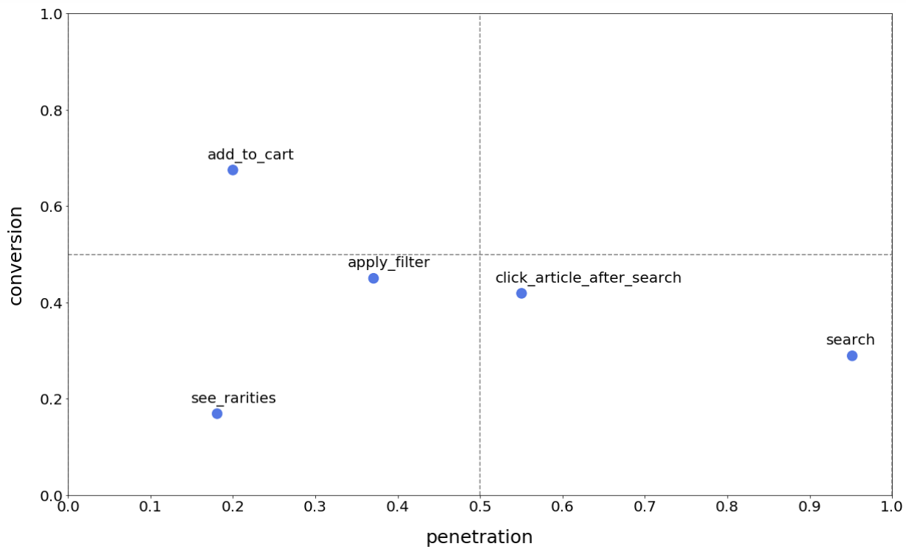
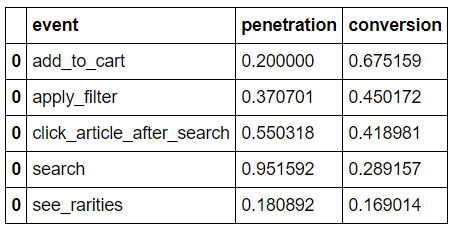

# BCG Analysis

A feature importance analysis, using BCG (Growth-Share) matrix.

This analysis help to identify key features, and groping or clustering them into 4 different categories, as the BCG matrix states (see link at the bottom for more information).

To install the package, run this command in the terminal: pip install bcganalysAis

We are going to see the following example.

# Example

```
import pandas as pd
from bcg_analysis import Generate_BCG

# you can find the toy_dataset.csv file in the example folder in the repo
df_example = pd.read_csv('toy_dataset.csv',sep=';')

df = Generate_BCG(df_example)

# generate the plot
df.plot_bcg()
```



```
# generate the table behind the plot
df.df_bcg()
```




# About BCG / Growth-Share matrix
https://en.wikipedia.org/wiki/Growth%E2%80%93share_matrix

https://www.feedough.com/what-is-a-bcg-matrix-examples-how-to-guide/


# Questions / concact

Please send an email to:
mat.eil1991@gmail.com
