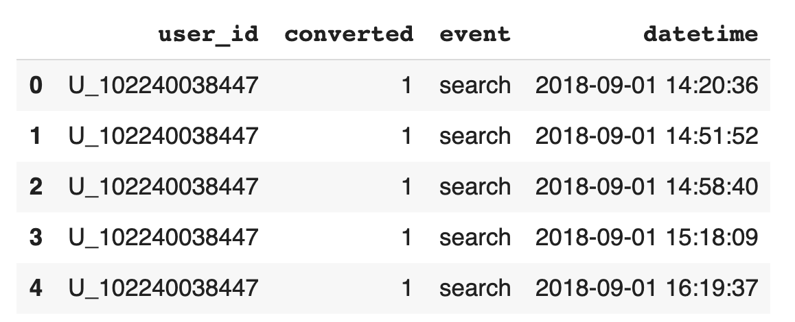

# BCG Analysis

I built this package with the objective of measuring in a simple, fast, but effective way, the impact of the key features of an app/webpage over the conversion.

It is a feature importance analysis, using BCG (Growth-Share) matrix.

This analysis helps to identify key features, grouping or clustering them into 4 different categories, as the BCG matrix states (see link at the bottom for more information).

To install the package, run this command in the terminal: pip install bcganalysis

We are going to see the following example.

# Example

We are going to use the toy dataset that is in the **example** folder. This is a dataframe which columns are **user_id** - **converted** - **event** - **datetime**.

The meaning of the columns are:
- user_id: the ID of the user
- converted: stating if the user converted or not
- event: the kind of feature that the user used
- datetime: time that this event was made.

Let's upload the toy dataset and start the analysis:

```
import pandas as pd

file_path = 'toy_dataset_sept.csv'

df = pd.read_csv(file_path).iloc[:,1:]

df.head(5)
```



```
import pandas as pd
from bcg_analysis import Generate_BCG

# you can find the toy_dataset.csv file in the example folder in the repo
df_example = pd.read_csv('toy_dataset.csv',sep=';')

df = Generate_BCG(df_example)

# generate the plot
df.plot_bcg()
```


```
# generate the table behind the plot
df.df_bcg()
```


# A deeper explanation

https://towardsdatascience.com/analyzing-feature-importance-user-behaviour-and-ux-performance-cbf32d55eff8

# About BCG / Growth-Share matrix
https://en.wikipedia.org/wiki/Growth%E2%80%93share_matrix

https://www.feedough.com/what-is-a-bcg-matrix-examples-how-to-guide/


# Questions / concact

Please send an email to:
mat.eil1991@gmail.com
